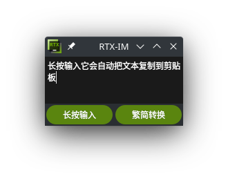

# 基于funASR的低延迟离线语音输入法



长按即可输入，它会自动把输出文本复制到剪贴板，并在鼠标光标位置粘贴，同时在文本框中显示

点击繁简转换按钮，文本框中的内容会进行繁简转换，并将转换结果复制到剪贴板

本项目基于python3.10开发，要求有桌面环境，推荐kde。windodows下也可以运行

# 安装
如果您使用的是Wayland环境，首先确保系统已安装`xdotool`用于模拟键盘输入，例如archlinux下安装：
```shell
pacman -S xdotool
```
在Ubuntu或Debian下安装：
```shell
sudo apt-get install xdotool
```

创建虚拟环境并安装`requirements.txt`所需的依赖 (windows安装`win_requirements.txt`中的依赖)
```shell
python3.10 -m venv venv

# 安装依赖
venv/bin/pip install -r requirements.txt
```

## 在运行之前，我们需要导出ONNX模型

### 命令行用法
```shell
funasr-export ++model=paraformer ++quantize=true ++device=cpu
```

### Python
```python
from funasr import AutoModel

model = AutoModel(model="paraformer", device="cpu")

res = model.export(quantize=True)
```

之后根据导出ONNX模型的目录，更改`Qt_ONNX_windows_style.py`文件的`model_dir`，确保一致，以便正常加载模型

# 运行

如果是X11或windodows环境，使用虚拟环境运行`Qt_ONNX_windows_style.py`即可，全局热键默认为 Scroll Lock 键，长按即可输入

如果是Wayland环境，使用虚拟环境运行`KDE_Wayland.py`即可，全局热键默认为 Scroll Lock 键，长按即可输入

# 与rime-ice输入法联动


- 使用rime-ice输入法，可以实现更好的输入体验，Rtxime可以提取rime-ice输入法的用户数据，实现热词联动

- 首先安装rime-ice输入法，快速部署可以点这里：https://github.com/Mark24Code/rime-auto-deploy

- 然后在rime-ice输入法的用户文件夹中，找到用户文件夹，将其中的rime_ice.userdb.txt文件路径复制到本项目的`/RTXIME/rime_ice2hotwords.py`文件中的`file_path`变量中

- 运行`rime_ice2hotwords.py`，它会自动提取热词，并生成hotwords.txt文件

- 然后运行`Rtxime.py`，它会自动加载`hotwords.txt`文件，实现热词联动

#

我的另一种语音输入法的方案，使电脑可以直接使用手机的输入法输入
https://github.com/pofice/linux-voice-input-method-2

funASR出处
https://github.com/alibaba-damo-academy/FunASR
