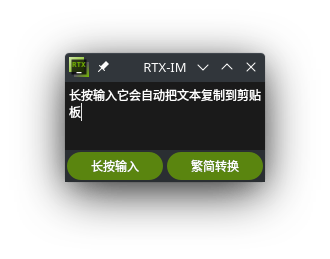

# Voice Input Method

基于 FunASR + PySide6 (Qt6) 的低延迟语音输入法，支持 Linux (X11/Wayland)、Windows 和 macOS。



长按热键即可录音，松开后自动识别并输入到当前光标位置。支持繁简转换、自定义热词、中文数字转阿拉伯数字。

## 安装

需要 Python 3.10+。

```shell
# 从源码安装
pip install .

# 或带可选功能
pip install ".[number]"     # 中文数字转换
pip install ".[macos]"      # macOS 权限检测
```

## 模型准备

首次使用前需要下载 FunASR 模型：

```shell
# 安装 modelscope
pip install modelscope

# 下载模型（支持热词的 SeacoParaformer）
modelscope download --model iic/speech_seaco_paraformer_large_asr_nat-zh-cn-16k-common-vocab8404-pytorch
```

然后在 `config.yaml` 中设置 `model_dir` 为模型目录路径。

## 运行

```shell
# 使用默认配置
voice-input

# 或指定配置文件
voice-input --config /path/to/config.yaml

# 或直接运行模块
python -m voice_input_method
```

全局热键默认为 **Scroll Lock** 键，长按录音，松开识别。可在 `config.yaml` 中修改。

## 配置

复制 `config.yaml` 并根据需要修改：

```yaml
model_type: seaco_paraformer   # 模型类型
model_dir: ""                   # 模型目录路径
hotkey: scroll_lock             # 全局热键
platform: ""                    # 留空自动检测，或指定 x11/wayland/windows/macos
enable_hotwords: true           # 启用自定义热词
enable_number_conversion: false # 启用中文数字转换
```

完整配置项见 [config.yaml](config.yaml)。

## 流式识别（实时出字）

支持三种模式：

| 模式 | 配置 | 效果 |
|------|------|------|
| 离线 | `streaming: false` | 录完后一次性识别（默认） |
| 纯流式 | `streaming: true` | 说话时实时显示文字，松开即完成 |
| 2pass | `streaming: true` + `two_pass: true` | 说话时实时显示，松开后用离线模型修正，兼顾速度和准确率 |

启用流式需要额外下载在线模型：

```shell
modelscope download --model damo/speech_paraformer-large_asr_nat-zh-cn-16k-common-vocab8404-online
```

在 `config.yaml` 中配置：

```yaml
streaming: true
streaming_model_dir: "/path/to/online/model"
two_pass: true  # 可选，推荐开启
```

## 自定义热词

编辑 `hotwords.txt`，每行一个词。运行时修改会自动热重载。

### 与 rime-ice 联动

可从 rime-ice 输入法提取用户词库作为热词：

```shell
python tools/rime_ice2hotwords.py /path/to/rime_ice.userdb.txt -o hotwords.txt
```

## 平台支持

| 平台 | 输入方式 | 备注 |
|------|----------|------|
| Linux X11 | 剪贴板 + Ctrl+V | 默认方式 |
| Linux Wayland | xdotool 逐字输入 | 需安装 xdotool |
| Windows | 剪贴板 + Ctrl+V | |
| macOS | 剪贴板 + Cmd+V | 需授予辅助功能和麦克风权限 |

## 项目结构

```
voice_input_method/
├── app.py              # 主窗口（统一所有平台）
├── audio.py            # 录音模块（自动设备检测）
├── recognition.py      # ASR 模型封装
├── text_processing.py  # 文本后处理
├── hotwords.py         # 热词管理
├── config.py           # 配置加载
├── platform/           # 平台后端
│   ├── x11.py
│   ├── wayland.py
│   ├── windows.py
│   └── macos.py
└── resources/          # 内置资源文件
```

## 致谢

- [FunASR](https://github.com/alibaba-damo-academy/FunASR) - 阿里达摩院语音识别框架
- [PySide6](https://doc.qt.io/qtforpython-6/) - Qt for Python (LGPL)
- [rime-ice](https://github.com/iDvel/rime-ice) - Rime 输入法配置
