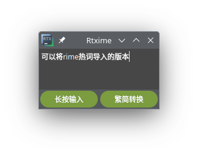

# 基于funASR的低延迟离线语音输入法


长按即可输入，它会自动把输出文本复制到剪贴板，并在鼠标光标位置粘贴，同时在文本框中显示

点击繁简转换按钮，文本框中的内容会进行繁简转换，并将转换结果复制到剪贴板

本项目基于python3.10开发，要求有桌面环境，推荐kde。windodows下也可以运行（windows仅在python3.10.6测试有效）

# 安装
首先切换到RTXIME目录
```shell
cd RTXIME/
```

创建虚拟环境并安装`requirements.txt`所需的依赖 (windows系统安装`win_requirements.txt`中的依赖)
```shell
python3 -m venv venv

# 安装依赖
venv/bin/pip install -r requirements.txt
```

## 在运行之前，我们需要导出ONNX模型

运行`model_export.py`

之后根据导出ONNX模型的目录，更改`Rtxime.py`文件的`model_dir`，确保一致，以便正常加载模型

# 运行

使用虚拟环境运行`Rtxime.py`即可，全局热键默认为 Scroll Lock 键，长按即可输入

# 与rime-ice输入法联动（可选，非必要）

## 也可以直接修改`hotwords.txt`实现自定义热词



使用rime-ice输入法，可以实现更好的输入体验，Rtxime可以提取rime-ice输入法的用户数据，实现热词联动。

- （可选）安装rime-ice输入法，快速部署可以点这里：https://github.com/Mark24Code/rime-auto-deploy

  - 然后在rime-ice输入法的用户文件夹中，找到用户文件夹，将其中的`rime_ice.userdb.txt`文件路径复制到本项目的`/RTXIME/rime_ice2hotwords.py`文件中的`file_path`变量中

  - 运行`rime_ice2hotwords.py`，它会自动提取热词，并生成`hotwords.txt`文件（默认忽略单字符中文热词，如需保留，请将`keep_single_char`变量设置为False）

- 运行`Rtxime.py`，它会自动加载`hotwords.txt`文件，实现热词联动（运行时修改`hotwords.txt`会自动热重载）

我的另一种语音输入法的方案，使电脑可以直接使用手机的输入法输入
https://github.com/pofice/linux-voice-input-method-2

funASR出处
https://github.com/alibaba-damo-academy/FunASR
