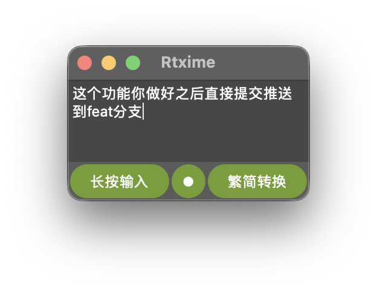

# Voice Input Method

基于 FunASR + PySide6 的低延迟中文语音输入法。GUI 与内核完全解耦，可被 AI agent 完整测试和扩展。



## 一键部署（AI 友好）

需要 Python 3.10+。如果系统没有，推荐用 `uv` 安装：

```shell
# 如果没有 Python 3.10+
uv python install 3.12

git clone https://github.com/pofice/voice-input-method.git && \
  cd voice-input-method && \
  uv venv --python 3.12 .venv && \
  uv pip install -e . --python .venv/bin/python && \
  .venv/bin/voice-input-cli doctor
```

`doctor` 命令会自动验证依赖、下载模型（~370MB，首次需要联网）、跑一次真实推理，并以结构化 JSON 报告每一步结果。
退出码 `0` = 全部就绪，非 0 = 某一步有问题（具体在 stderr 和 JSON 里）。

macOS 用户需要在**系统设置 → 隐私与安全性 → 辅助功能**中授权终端，否则热键和自动粘贴不工作。

之后启动 GUI：

```shell
.venv/bin/voice-input
```

---

## 给 AI agent 的导读

这个 README 不试图复述代码细节（那些会过时）。下面这张表告诉你：**什么问题去看哪个文件**。读代码永远是事实的唯一来源。

| 想知道什么 | 去看哪里 |
|----------|---------|
| 整体架构如何串起来 | `voice_input_method/factory.py` — 一个文件看完所有依赖装配 |
| 核心业务流水线（录音→识别→后处理→粘贴） | `voice_input_method/engine.py` 的 `VoiceEngine` 类 |
| 各组件的接口契约 | `voice_input_method/protocols.py` — Protocol 定义 |
| ASR 识别后端（4 种可选） | `voice_input_method/recognition/` — funasr / sherpa-sensevoice / sherpa-nano / qwen3-asr |
| 录音怎么做（含运行时切换设备、崩溃恢复） | `voice_input_method/audio.py` |
| 文本后处理（繁简、热词、字母合并、纠错） | `voice_input_method/text_processing.py`、`voice_input_method/hotwords.py` |
| 长音频 VAD 分段 | `voice_input_method/vad.py` — Silero VAD 自动切段，短音频跳过 |
| 命令行入口 / 各命令选项 | `voice_input_method/cli.py`，或运行 `voice-input-cli --help` |
| GUI 怎么和 engine 交互 | `voice_input_method/app.py` — 这是一个薄壳，业务逻辑全在 `engine` 里 |
| 录音指示器（浮动红点） | `voice_input_method/indicator.py` — macOS 用 AppKit 子进程实现 |
| 怎么写一个 mock 来测试 | `tests/mocks.py`，对照 `protocols.py` 实现就行 |
| 完整 mock 测试示例 | `tests/test_engine.py` |
| 用真实模型的端到端测试 | `tests/test_integration.py` |
| 配置项有哪些 | `voice_input_method/config.py` 的 `Config` dataclass + `config.yaml` |
| 默认模型 ID | `voice_input_method/config.py` 的 `DEFAULT_OFFLINE_MODELS` / `DEFAULT_STREAMING_MODEL` |
| 平台后端如何加新平台 | `voice_input_method/platform/base.py` 的 `PlatformBackend` ABC，然后参考 `x11.py`/`macos.py` 等 |
| 热键配置和 toggle 模式 | `voice_input_method/hotkey.py` — `CombinedHotkeyListener` 在一个 Listener 里处理两个热键 |
| AI 开发规范和提交规范 | `CLAUDE.md` — 架构约束、变更同步清单、新增后端步骤（非 Claude Code 用户也应读） |

**架构原则**（这一段不会变，可以信赖）：
- 依赖只能从外向内：GUI/CLI → factory → engine → protocols → 具体实现
- core 层（`engine.py`、`protocols.py`、`text_processing.py`、`config.py`）从不 import GUI
- 所有外部依赖（音频硬件、ASR 模型、UI、键盘、剪贴板）都是可替换的端口适配器
- 任何核心流水线变更都应该可以用 `tests/mocks.py` 完整测试，无需 GUI/麦克风/模型

**入口点**（`pyproject.toml` `[project.scripts]` 里的真相）：
- `voice-input` → `voice_input_method.__main__:main`（GUI 模式）
- `voice-input-cli` → `voice_input_method.cli:main`（headless CLI，AI 用这个）

---

## 安装

需要 Python 3.10+。

```shell
pip install .                    # 基础安装（funasr-onnx SeacoParaformer 默认后端）
pip install -e ".[dev]"          # 开发环境（pytest + ruff）
pip install ".[sherpa]"          # SenseVoice / Fun-ASR-Nano / Qwen3-ASR 后端（需 sherpa-onnx）
pip install ".[macos]"           # macOS 录音指示器（需 PyObjC）
pip install ".[integration]"     # 集成测试需要的额外依赖
```

具体的 extras 组合请直接看 `pyproject.toml` 的 `[project.optional-dependencies]`。

## 模型

默认使用预导出的 ONNX 模型（seaco_paraformer，支持热词），**首次启动自动下载**，无需手动操作：

- 离线模型：`pofice/speech_seaco_paraformer_large_onnx`（~370MB）
- 流式模型（启用 streaming 时）：`damo/speech_paraformer-large_asr_nat-zh-cn-16k-common-vocab8404-online-onnx`

模型缓存在 `~/.cache/modelscope/hub/models/`，下载后可离线使用。

默认模型 ID 在 `voice_input_method/config.py` 的 `DEFAULT_OFFLINE_MODELS` / `DEFAULT_STREAMING_MODEL`，**这两个常量是真相**。

## 运行

### GUI 模式

```shell
voice-input
voice-input --config /path/to/config.yaml
voice-input --device 2                      # 指定麦克风设备（索引号用 voice-input-cli devices 查）
```

三种录音方式：
- **长按热键**（默认 `scroll_lock`，macOS 可用 `fn`）：按住录音，松开识别
- **Toggle 热键**（默认 `alt`/Option）：按一次开始长录音，再按一次停止并识别
- **GUI 长录音按钮**（窗口底部圆形按钮 ●）：点击开始长录音，再点停止并识别

长录音结果（文字 + 原始音频）自动保存到 `~/voice-recordings/`。

两种热键互斥：长按录音时 toggle 热键不响应，反之亦然。

录音时屏幕底部会出现浮动指示器（红点 = 普通录音，红点 + 白圈 = 长录音）。

**运行时切换麦克风**：在窗口上右键打开菜单 →「切换麦克风」，选择其他输入设备，无需重启。

热键在 `config.yaml` 的 `hotkey` 和 `toggle_hotkey` 里配置。

### CLI 模式（AI / 脚本 / CI）

```shell
voice-input-cli --help                          # 顶层帮助
voice-input-cli transcribe --help               # 单文件转写所有选项
voice-input-cli batch --help                    # 批量转写所有选项
voice-input-cli listen --help                   # 麦克风录音转写所有选项
voice-input-cli devices                         # 列出可用麦克风设备（JSON）
voice-input-cli info                            # 版本和默认模型 ID

voice-input-cli transcribe input.wav            # 最简用法
voice-input-cli transcribe input.wav --json     # 结构化输出（含耗时）

# 麦克风录音转写（无需 GUI / 桌面环境）
voice-input-cli listen                          # 按 Enter 停止录音并转写
voice-input-cli listen --duration 5             # 录 5 秒自动停止
voice-input-cli listen --device 1 --json        # 指定麦克风 + JSON 输出
voice-input-cli listen --save recording.wav     # 同时保存录音文件
```

CLI 完全 headless，不需要 GUI/桌面环境。`transcribe` / `batch` 吃 WAV 文件吐文字；`listen` 直接录音转写，适合 SSH 远程或无桌面场景。结构化 JSON 输出适合 AI agent 拿来判断改动有没有效果。

**所有命令**：进度信息走 stderr，结果走 stdout，可安全 pipe。

### Exit Code 契约

| 退出码 | 含义 | 示例 |
|--------|------|------|
| `0` | 成功 | 正常转写、doctor 全部通过 |
| `1` | 输入错误（调用方可修复） | 文件不存在、目录下无 .wav、参数错误、doctor 某步失败 |

未捕获的异常（`ConfigError`、模型加载失败等）会导致 Python traceback + 非零退出码，stderr 里有完整错误信息。

### JSON 输出格式

**`transcribe --json`**：
```json
{
  "input": "input.wav",
  "text": "识别结果文字",
  "elapsed_ms": 1234,
  "mode": "offline"
}
```
streaming 模式额外包含 `"partials": ["片段1", "片段2"]`。

**`batch`**（始终输出 JSONL，每行一条）：
```json
{"file": "001.wav", "text": "识别结果", "elapsed_ms": 890}
```

**`listen --json`**：
```json
{
  "text": "识别结果文字",
  "recorded_seconds": 3.2,
  "elapsed_ms": 1456
}
```

**`devices`**（始终 JSON）：
```json
[
  {"index": 0, "name": "MacBook Pro Microphone", "channels": 1, "sample_rate": 48000},
  {"index": 2, "name": "USB Audio", "channels": 2, "sample_rate": 44100}
]
```

**`doctor`**：
```json
{
  "ok": true,
  "checks": [
    {"check": "import core dependencies", "status": "ok", "detail": "8 modules importable"},
    {"check": "ASR model load", "status": "ok", "detail": "loaded funasr (...)"}
  ]
}
```
失败的 check 会有 `"status": "fail"` 和 `"error": "错误信息"`。

## 识别后端

| 后端 | 模型 | 大小 | 热词 | 标点/ITN | 流式 | 安装 |
|------|------|------|------|---------|------|------|
| `funasr`（默认） | SeacoParaformer | 370MB | ✅ 每次调用 | ❌ | ✅ | 核心依赖 |
| `sherpa-sensevoice` | SenseVoice-Small | 229MB(int8) | ❌（仅同音字替换 HR） | ✅ 内置 | ❌ | `pip install ".[sherpa]"` |
| `sherpa-nano` | Fun-ASR-Nano (LLM) | ~800MB(int8) | ✅ 加载时烤入 | ✅ 内置 | ❌ | `pip install ".[sherpa]"` |
| `qwen3-asr` | Qwen3-ASR-0.6B (LLM) | ~500MB(int8) | ✅ 加载时烤入 | ✅ 内置 | ❌ | `pip install ".[sherpa]"` |

> **热词差异**：`funasr` 每次 transcribe 都接受新热词；`sherpa-nano` 和 `qwen3-asr` 把热词烤进构造函数，修改 `hotwords.txt` 后必须重启程序才生效。LLM 后端（`sherpa-nano`、`qwen3-asr`）还支持自定义 LLM 提示词，可以塞业务上下文比硬编热词更灵活。
>
> **长音频注意**：`funasr` 和 `sherpa-sensevoice` 无长度限制。`sherpa-nano` 和 `qwen3-asr` 是 LLM 架构，有 KV cache 长度限制（默认 `max_total_len=512`）。长音频（>30s）建议使用 `funasr` 或 `sherpa-sensevoice`，或配合 VAD 分段。`qwen3-asr` 的 `max_total_len` 可运行时调大。

### 模型下载

`funasr` 后端首次启动自动下载，无需手动操作。`sherpa-*` 后端需要手动下载：

```shell
# sherpa-sensevoice
curl -SL -O https://github.com/k2-fsa/sherpa-onnx/releases/download/asr-models/sherpa-onnx-sense-voice-zh-en-ja-ko-yue-2024-07-17.tar.bz2
tar xjf sherpa-onnx-sense-voice-*.tar.bz2

# sherpa-nano
curl -SL -O https://github.com/k2-fsa/sherpa-onnx/releases/download/asr-models/sherpa-onnx-funasr-nano-int8-2025-12-30.tar.bz2
tar xjf sherpa-onnx-funasr-nano-*.tar.bz2

# qwen3-asr（52 语言 + 22 中国方言，0.6B 参数，SOTA 精度）
curl -SL -O https://github.com/k2-fsa/sherpa-onnx/releases/download/asr-models/sherpa-onnx-qwen3-asr-0.6B-int8-2026-03-25.tar.bz2
tar xjf sherpa-onnx-qwen3-asr-*.tar.bz2
```

### CLI 切换（一次性）

```shell
# funasr（默认，可省略 --backend）
voice-input-cli transcribe input.wav

# sherpa-sensevoice
voice-input-cli transcribe input.wav \
  --backend sherpa-sensevoice \
  --sensevoice-model ./sherpa-onnx-sense-voice-.../model.int8.onnx \
  --sensevoice-tokens ./sherpa-onnx-sense-voice-.../tokens.txt

# sherpa-nano（--nano-model-dir 是目录，目录内必须有 encoder_adaptor / llm / embedding / Qwen3-0.6B）
voice-input-cli transcribe input.wav \
  --backend sherpa-nano \
  --nano-model-dir ./sherpa-onnx-funasr-nano-int8-2025-12-30

# qwen3-asr（--qwen3-model-dir 是目录，目录内必须有 conv_frontend / encoder / decoder / tokenizer）
voice-input-cli transcribe input.wav \
  --backend qwen3-asr \
  --qwen3-model-dir ./sherpa-onnx-qwen3-asr-0.6B-int8-2026-03-25

# qwen3-asr 长音频（调大 KV cache 和输出 token 限制）
voice-input-cli transcribe long_audio.wav \
  --backend qwen3-asr \
  --qwen3-model-dir ./sherpa-onnx-qwen3-asr-0.6B-int8-2026-03-25 \
  --qwen3-max-total-len 2048 --qwen3-max-new-tokens 512
```

同样的参数适用于 `batch`、`listen` 和 `doctor` 子命令：

```shell
# listen 也支持切后端
voice-input-cli listen --backend sherpa-nano --nano-model-dir ./sherpa-onnx-funasr-nano-int8-2025-12-30
voice-input-cli listen --backend qwen3-asr --qwen3-model-dir ./sherpa-onnx-qwen3-asr-0.6B-int8-2026-03-25
```

### config.yaml 切换（GUI 常驻）

```yaml
recognizer_backend: sherpa-nano   # funasr / sherpa-sensevoice / sherpa-nano / qwen3-asr

# sherpa-sensevoice 字段（仅在该后端下生效）
sensevoice_model_path: "/abs/path/model.int8.onnx"
sensevoice_tokens_path: "/abs/path/tokens.txt"
sensevoice_language: "zh"

# sherpa-nano 字段（仅在该后端下生效）
nano_model_dir: "/abs/path/sherpa-onnx-funasr-nano-int8-2025-12-30"
nano_system_prompt: "You are a helpful assistant."   # 可塞业务上下文，如 "You transcribe coding/AI tool names"
nano_user_prompt: "语音转写:"

# qwen3-asr 字段（仅在该后端下生效）
qwen3_model_dir: "/abs/path/sherpa-onnx-qwen3-asr-0.6B-int8-2026-03-25"
qwen3_max_total_len: 512     # KV cache 长度，长音频调大（如 1024/2048）
qwen3_max_new_tokens: 128    # 最大输出 token 数，长音频调大（如 256/512）
```

切换 sherpa 后端时，缺必填字段会立刻抛出 `ConfigError`，错误消息会指出缺哪个字段。`streaming: true` 只对 `funasr` 生效，配合 sherpa 后端会发 `RuntimeWarning` 并自动禁用。

### VAD 长音频分段

长音频（>15 秒）自动使用 Silero VAD 切成语音段，逐段识别后拼接。这解决了 LLM 后端（`sherpa-nano`、`qwen3-asr`）的 KV cache 溢出问题，也防止编码器后端的内存问题。

```bash
# 下载 Silero VAD 模型（~2MB，仅需一次）
wget https://github.com/k2-fsa/sherpa-onnx/releases/download/asr-models/silero_vad.onnx
# 放在项目根目录、models/ 子目录、或 ~/.cache/sherpa-onnx/ 均可自动检测
```

```yaml
# config.yaml
enable_vad: true               # 默认开启
vad_max_speech_duration: 15    # 每段最长秒数
```

短音频（<15 秒）自动跳过 VAD，零额外开销。如果 VAD 模型不存在，长音频会直接送 ASR（可能在 LLM 后端上截断）。

## 功能

| 功能 | 默认 | 配置项 |
|------|------|--------|
| 降噪（识别前） | 开 | `enable_noise_reduction` |
| 热词增强 | 开 | `enable_hotwords` + `hotwords.txt` |
| 热词纠错（`wrong -> right`） | 开 | `hotwords.txt` 中的纠错规则 |
| 繁简转换 | 开 | `enable_traditional_chinese` |
| 单字母合并（A I → AI） | 始终开启 | — |
| 末尾标点剥离（。！？等） | 开 | `strip_trailing_punctuation` |
| VAD 长音频分段 | 开 | `enable_vad` + `vad_max_speech_duration` |

## 测试

```shell
pytest tests/ -m "not integration"   # 单元测试，~2s，无外部依赖
pytest tests/ -m integration         # 集成测试，需先下载模型
pytest tests/                        # 全部
pytest tests/ --cov=voice_input_method
```

测试分两层：
- **单元测试**：用 `tests/mocks.py` 的 mock 对象，跑 engine 的所有路径，零外部依赖
- **集成测试**：`tests/test_integration.py` 用真实 Paraformer ONNX 模型 + 真实中文语音音频（`tests/fixtures/`）

### AI 怎么用 mock 测试核心流水线

最小例子（详见 `tests/test_engine.py`）：

```python
from voice_input_method.engine import VoiceEngine, EngineConfig
from tests.mocks import MockRecorder, MockRecognizer, MockPaster

engine = VoiceEngine(
    config=EngineConfig(),
    recorder=MockRecorder(),
    recognizer=MockRecognizer(text="测试结果"),
    paster=MockPaster(),
)
engine.start()
engine.start_recording()
engine.stop_recording()
```

要从 `Config` 直接装配真实 engine（不要 GUI），用 `voice_input_method.factory.create_engine`，详见该文件。

### AI 改完代码后的标准验证

```shell
# 单元测试 + doctor 一起跑，exit 0 = 安全提交
pytest tests/ -m "not integration" && voice-input-cli doctor
```

### Python API 最小调用

不想走 CLI，直接在 Python 里调用：

```python
from voice_input_method.config import Config
from voice_input_method.factory import _create_recognizer

config = Config()  # 默认 funasr 后端
recognizer = _create_recognizer(config)
recognizer.load()
text = recognizer.transcribe("input.wav")
print(text)
```

切后端只需要改 Config：
```python
config = Config(recognizer_backend="sherpa-nano", nano_model_dir="/path/to/model")
config = Config(recognizer_backend="qwen3-asr", qwen3_model_dir="/path/to/model")
recognizer = _create_recognizer(config)
```

## 平台

| 平台 | 输入方式 | 注意事项 |
|------|---------|---------|
| Linux X11 | 剪贴板 + Ctrl+V | 默认 |
| Linux Wayland | xdotool 逐字输入 | 需安装 xdotool |
| Windows | 剪贴板 + Ctrl+V | |
| macOS | 剪贴板 + Cmd+V | 需授予辅助功能和麦克风权限 |

各平台的具体实现在 `voice_input_method/platform/{x11,wayland,windows,macos}.py`，每个文件不到 30 行。加新平台只需要继承 `PlatformBackend` 并在 `platform/__init__.py:get_backend()` 注册。

## 自定义热词与纠错

编辑 `hotwords.txt`，运行时修改自动热重载。规则见 `voice_input_method/hotwords.py` 的 `HotwordManager`。

```text
# 热词：每行一个，增强 ASR 对这些词的识别率
Claude Code
Anthropic
语音输入法

# 纠错规则：wrong -> right，ASR 识别后自动替换
Cloud Code -> Claude Code
Anthrobic -> Anthropic
```

热词提高 ASR 对该词的识别率（funasr 每次调用生效，sherpa-nano 加载时烤入需重启）。纠错规则是后处理替换，对所有后端生效，不需要重启。

```shell
python tools/rime_ice2hotwords.py /path/to/rime_ice.userdb.txt -o hotwords.txt
```

## 常见问题排查

| 报错 | 原因 | 解决 |
|------|------|------|
| `ConfigError: sensevoice_model_path is required` | 选了 sherpa 后端但没配模型路径 | 按「模型下载」章节下载模型，配置路径 |
| `OSError: PortAudio library not found` | 系统缺 PortAudio（`listen` / `devices` 需要） | macOS: `brew install portaudio`；Ubuntu: `apt install libportaudio2` |
| `ModuleNotFoundError: No module named 'sherpa_onnx'` | 用了 sherpa 后端但没装 sherpa-onnx | `pip install ".[sherpa]"` |
| `RuntimeWarning: streaming is only supported with funasr` | `streaming: true` 配了非 funasr 后端 | streaming 自动被禁用，改用 `funasr` 或关掉 `streaming` |
| 模型下载卡住 / 超时 | ModelScope CDN 不稳 | 设 `MODELSCOPE_CACHE` 环境变量指定缓存目录，或手动下载到 `~/.cache/modelscope/` |

## 致谢

- [FunASR](https://github.com/alibaba-damo-academy/FunASR) — 阿里达摩院语音识别框架
- [PySide6](https://doc.qt.io/qtforpython-6/) — Qt for Python (LGPL)
- [rime-ice](https://github.com/iDvel/rime-ice) — Rime 输入法配置
